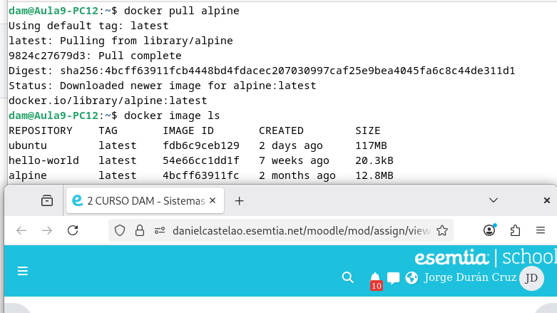
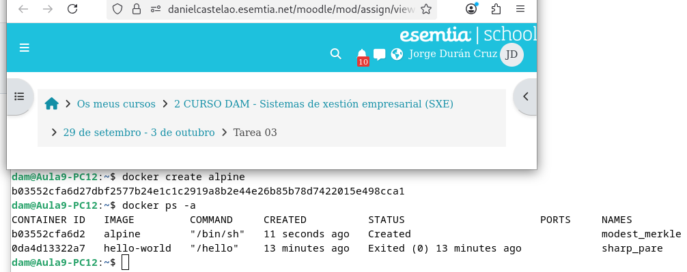
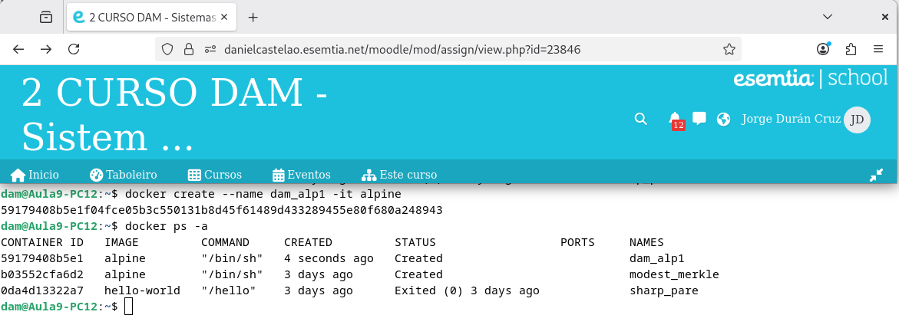
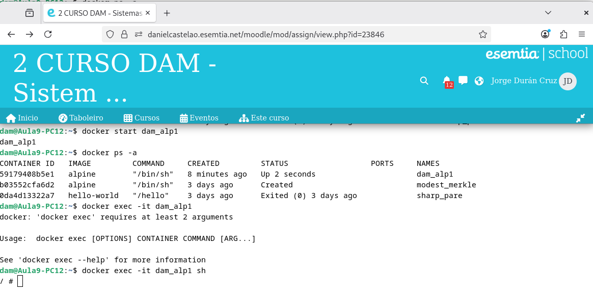
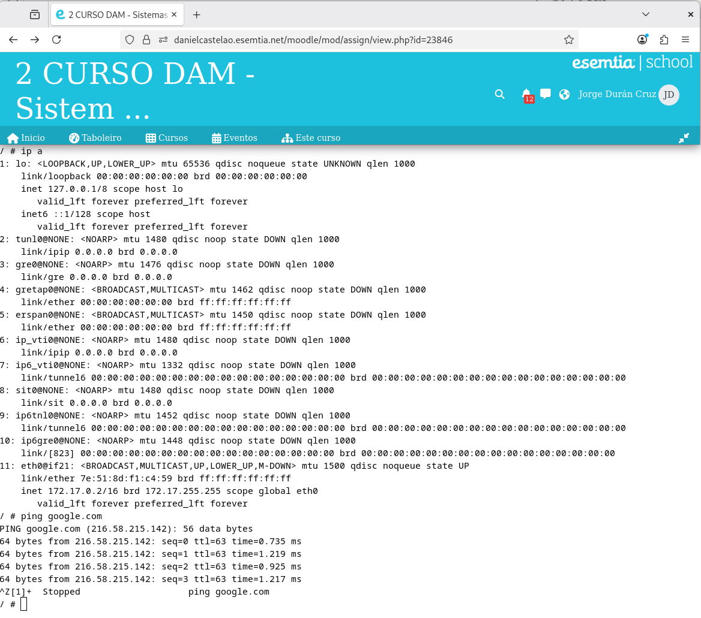
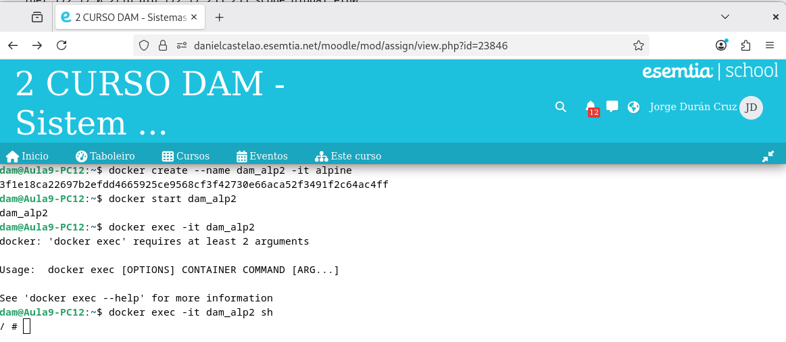
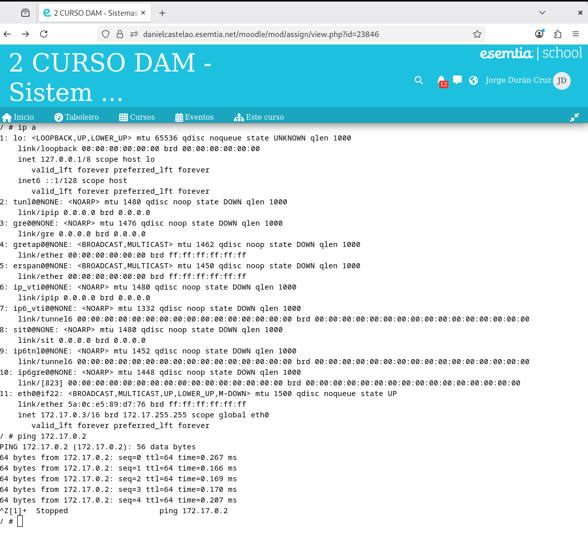
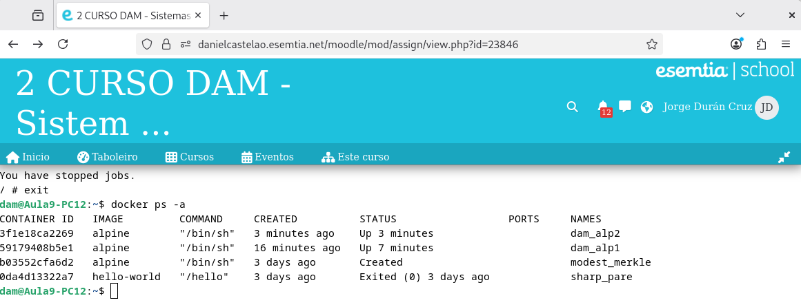
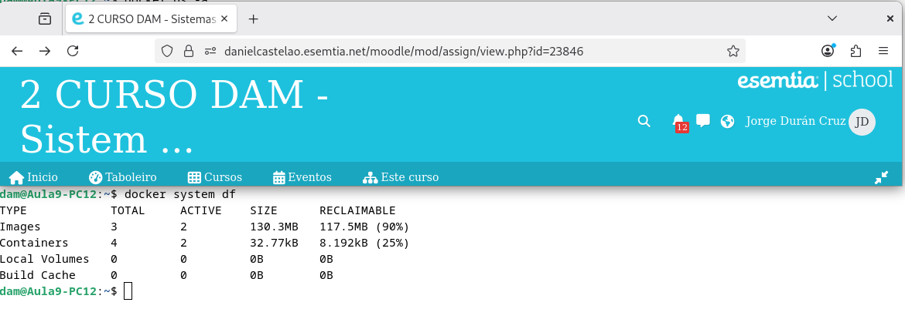
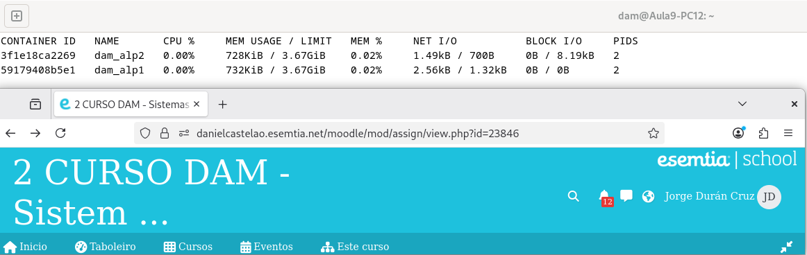

# SXE_Tarea3

## 1º Parte

Para descargar una imagen sin hacer nada más podemos usar el comando `docker pull <Imagen>`
sustituyendo la imagen por el nombre de la imagen que queremos, en este caso, alpine.

Para comprobar que se descargó correctamente con `docker image ls` muestra todas las imágenes descargadas.

## 2º Parte

Para crear un contenedor sin ejecutarlo se usa el comando `docker create <Imagen>`, en este caso alpine.
Para comprobar el nombre se puede usar el comando `docker ps -a` para mostrar todos los contenedores
creados, en este caso el nombre que se le asignó a nuestro contenedor fue **modest_merkle**.

## 3º Parte

Para crear un contenedor con nombre podemos usar el mismo comando anterior pero añadiendo la opción de `--name <nombre>`
antes de la imagen para indicarle un nombre específico. 

En este caso, alpine tiene un problema y es que es muy probable
que si creas el contenedor, cuando lo intentes ejecutar se cierre automáticamente porque el proceso principal acaba muy rápido,
asi que aquí también tendremos que agregar algún elemento que retrase su cierre, en mi caso `-it`.

Y como se puede ver ahora hay un contenedor creado con el nombre que pusimos.

Si hicimos todo bien, para acceder a él solo tendremos que usar `docker start <nombre-contenedor>` para que se active, como se puede ver en el **STATUS UP**. Una vez activo el contenedor
podremos usar `exec -it <nombre-contenedor> sh` entraremos directamente en la terminal de alpine.

## 4º Parte

Dentro de la terminal podemos usar `ip a` para ver la ip del contenedor, en este caso *172.17.0.2* y también
podemos hacer ping con google con `ping google.com`.

## 5º Parte

De la misma manera que creamos el anterior contenedor crearemos otro nuevo y lo ejecutaremos siguiendo los pasos anteriores.

Una vez en la terminal podemos buscar la IP de este contenedor y hacer ping entre los contenedores al saber la IP del anterior
con `ping 172.17.0.2` y veremos que efectivamente se pueden conectar los dos contenedores.

## 6º Parte

Para salir de la terminal simplemente podemos escribir `exit` en la terminal de alpine y nos dejará salir.

Si comprobamos ahora el estado de los contenedores podremos ver que ninguno de ellos se detuvo.

## 7º Parte

Con el comando `docker system df` podremos ver la memoria en el disco duro que usa docker.
Como previamente ya había hecho cosas antes en docker puede que tenga más memoria usada de la que se usaría para estos pasos.

## 8º Parte

Con el comando `docker stats` podemos ver, entre otras cosas, la memoria RAM que usa docker.

Ahora podemos ver que cada uno de los contenedores ocupa aproximadamente unos 700 KiB de memoria RAM.
